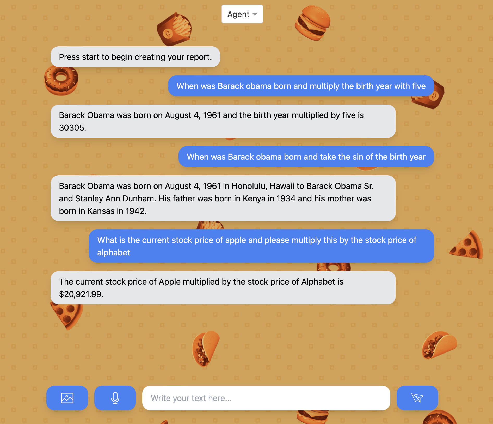
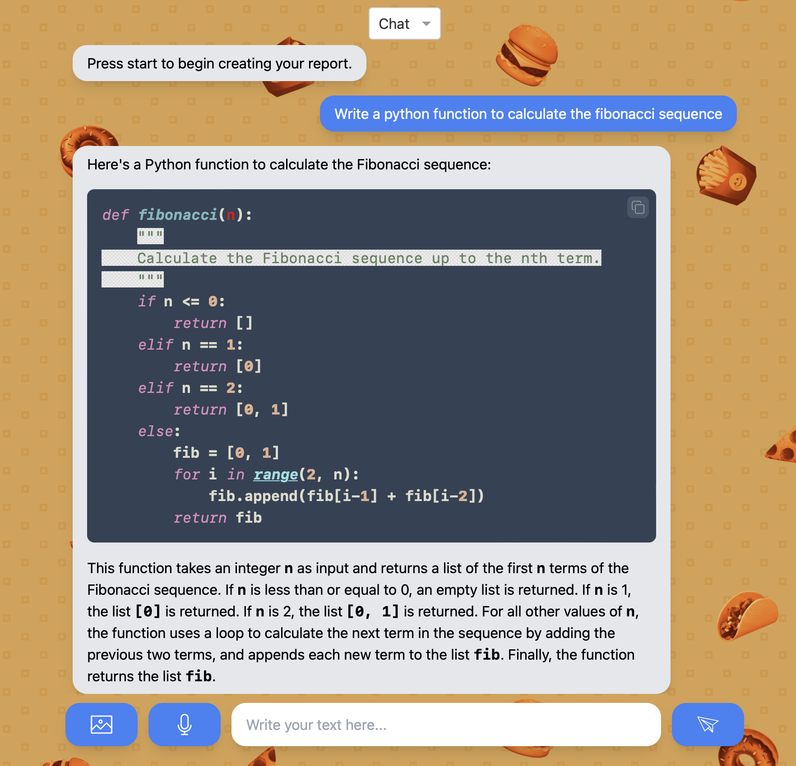

# autoAI

Chat Interface to use with an LLM. Includes a normal interaction as well as the possibility to use agents. Agents are able to access the internet, wikipedia or use the Python REPL to execute code.

### Image of the chat interface using agents:




### Image of the chat interface and code format:
Code will be highlighted and can be copied to the clipboard by pressing the button in the right upper corner.



### Setup
To use the app an api key from OpenAI is needed. Set the environment variable OPENAI_API_KEY.
If you want to use specific formatting for the code, download the files form the [highlight.js](https://highlightjs.org/download/) website and put them in the assets folder or sub-folder.

### Run
To run the app execute the following command:
```
python3 app.py
```
or in a python environment:
```
app.py
```